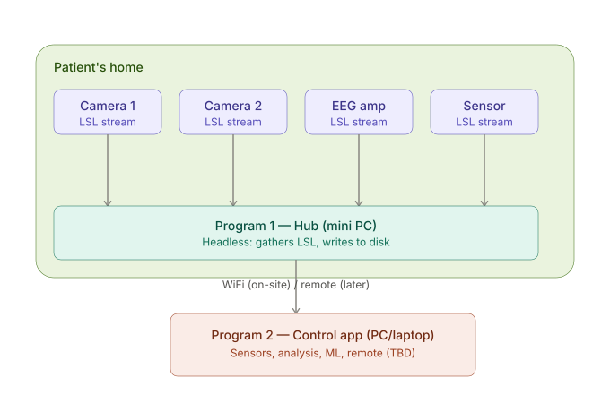

# Video-EEG system — architecture

## Sensors
- EEG amplifier (Perun32), on Raspberry Pi Zero 2W
- 2-3 cameras, on Raspberry Pi(s)
- Additional sensors later

Each Pi runs a **driver**: reads its hardware, sends the data as an **LSL stream** over local WiFi.

## Hub (Program 1)
- Headless daemon, written in **C++**.
- Runs on a device at the patient's home (laptop now, small dedicated device later).
- Job: subscribe to all LSL streams, sync them, write one **.xdf** file per recording session.
- Auto-starts, stays alive, no UI.
- One session at a time.

## Control app (Program 2) — planned, not built yet
- Separate full application, runs on a laptop/PC.
- Connects to the Hub over WiFi (on-site) or remotely (later).
- Will handle: start/stop recording, live view, impedance checks, sensor management, and later analysis/ML/remote features.

## Current priority
1. Rewrite the EEG amp driver on the Pi Zero 2W (acquisition + impedance check).
2. Build the Hub daemon.
3. Camera driver.
4. Program 2 — later.
